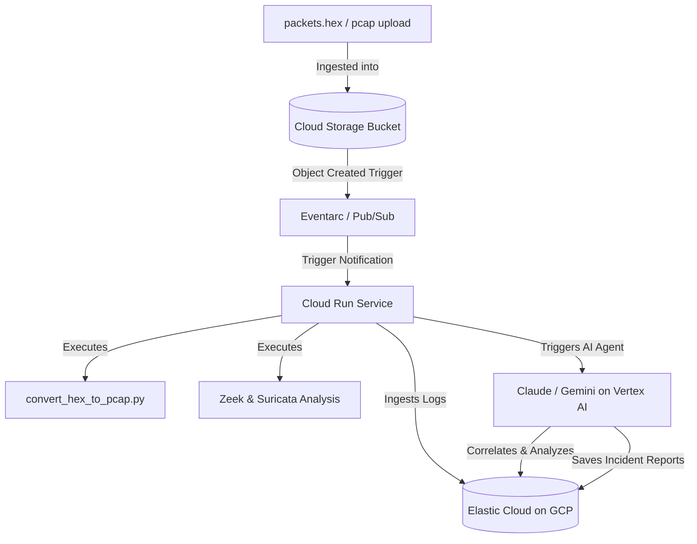

# Google Cloud Platform (GCP) Deployment Guide

This guide details the architecture and step-by-step instructions to deploy the **SOC AI Incident Agent Pipeline** in a production-ready, highly secure environment on Google Cloud Platform.

---

## 🏗️ Production Architecture on GCP

The production system is designed as a **serverless, event-driven security pipeline** that automatically turns raw packet traces into correlated intelligence:



### Components:
1. **Google Cloud Run (Services & Jobs)**: Hosts the containerized FastAPI backend and MCP AI Agent. Scales dynamically, meaning zero cost when idle.
2. **Google Cloud Storage (GCS)**: Acts as the secure landing zone for incoming PCAP or hex files.
3. **Eventarc / Pub/Sub**: Detects GCS bucket uploads and triggers Cloud Run to parse, analyze, and ingest packet logs immediately.
4. **Vertex AI (Gemini 2.5 Flash / 1.5 Pro)**: Enterprise-grade LLM execution with strict data privacy, virtual networking, and identity controls.
5. **Elastic Cloud on GCP**: Multi-node managed cluster hosting indexed security logs and correlated incident reports.
6. **Google Secret Manager**: Secures sensitive credentials (Gemini API keys, Elastic tokens).

---

## 🔐 Security Hardening & IAM Best Practices

In a production environment, avoid exposing environment variables or administrative keys in plain text. Always follow these security rules:

* **Principle of Least Privilege**: Create a custom service account for Cloud Run rather than using the default Compute Engine service account.
* **Secret Manager Integration**: Inject sensitive API keys directly as secure environment variables at runtime via Google Secret Manager.
* **VPC Service Controls**: Place Cloud Run and Elasticsearch within a Shared VPC to keep network traffic completely private and prevent data exfiltration.

---

## 🚀 Step-by-Step Deployment Instructions

### Step 1: Initialize GCP Environment
Ensure you have the Google Cloud SDK (`gcloud` CLI) installed and run the initialization commands:

```bash
# Log in to your Google Account
gcloud auth login

# Set your active GCP project
gcloud config set project YOUR_GCP_PROJECT_ID
```

### Step 2: Configure Environment Variables
Create a production `.env` file or export your pipeline secrets:

```bash
# Set your production configurations
export GEMINI_API_KEY="your-vertex-or-gemini-key"
export ES_URL="https://your-elastic-cloud-instance:9243"
```

### Step 3: Run the Deployer Script
Execute the provided automated deployment script:

```bash
./deploy.sh
```

The script will automatically:
1. Enable the required GCP APIs (Cloud Run, Cloud Build, Artifact Registry).
2. Create an Artifact Registry repository named `soc-containers` in `us-central1`.
3. Submit a Cloud Build job to package the Docker container, store it in Artifact Registry, and deploy it live to Google Cloud Run.

---

## ⚡ Event-Driven Pipeline Configuration (Trigger on Upload)

To automate the pipeline so that it runs every time a new `.hex` or `.pcap` file is uploaded to your bucket, configure GCS bucket triggers:

1. **Create a Landing Bucket**:
   ```bash
   gcloud storage buckets create gs://your-soc-incoming-packets --location=us-central1
   ```

2. **Grant GCS Pub/Sub Publisher Permissions**:
   ```bash
   SERVICE_ACCOUNT=$(gcloud storage service-agent --project=YOUR_GCP_PROJECT_ID)
   gcloud projects add-iam-policy-binding YOUR_GCP_PROJECT_ID \
       --member="serviceAccount:$SERVICE_ACCOUNT" \
       --role="roles/pubsub.publisher"
   ```

3. **Deploy the Cloud Run Trigger (Eventarc)**:
   ```bash
   gcloud eventarc triggers create soc-upload-trigger \
       --destination-run-service=soc-ai-agent-service \
       --destination-run-path="/agent/run" \
       --event-filters="type=google.cloud.storage.object.v1.finalized" \
       --event-filters="bucket=your-soc-incoming-packets" \
       --service-account="your-custom-runner@YOUR_GCP_PROJECT_ID.iam.gserviceaccount.com"
   ```

Now, any raw files uploaded to the GCS bucket will automatically trigger a secure, containerized run of the Zeek/Suricata layer and AI incident reasoning loop!
