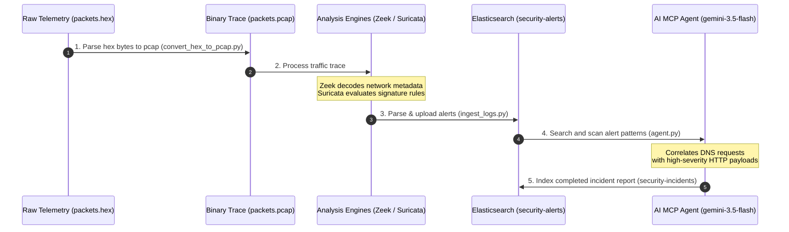

# SOC AI Incident Pipeline: Orchestration & File Catalog

This document explains the end-to-end orchestration of the **SOC AI Incident Detection Pipeline**—tracing the flow from raw packet captures to automated AI-correlated security intelligence—and maps the role of every file in the system.

---

## 🔄 End-to-End Pipeline Orchestration Flow

The pipeline operates in four continuous stages, transforming low-level network telemetry into verified incident response reports:

---

## 🛠️ Stage-by-Stage Breakdown

### Stage 1: Network Trace Decoupling
* **Orchestration**: The pipeline begins with raw hex-encoded Ethernet frames (`packets.hex`) captured at a network interface tap.
* **Mechanism**: A lightweight python converter (`convert_hex_to_pcap.py`) reads the hex streams, strips invalid characters, packs the frames into standard `PCAP` global headers, and outputs `packets.pcap`.

### Stage 2: Deep Packet Decoders & Signatures
* **Orchestration**: The binary `packets.pcap` is processed concurrently by two gold-standard network monitors:
  * **Zeek**: Decodes protocol layer transactions (DNS, TCP, DHCP) to map application traffic behavior.
  * **Suricata**: Validates packet bytes against rule databases to detect known exploit signatures and protocol anomalies.
* **Outputs**: Raw tab-separated Zeek log collections (`zeek_logs/`) and structured JSON alerts (`suricata_logs/eve.json`).

### Stage 3: High-Performance Database Ingestion
* **Orchestration**: An automated Python loader (`backend/ingest_logs.py`) handles schema parsing:
  * Reads Zeek tab-logs and converts them into validated datetime-formatted payloads.
  * Filters Suricata's `eve.json` for active signature alerts.
* **Interface**: Streams events directly into the FastAPI endpoint router (`backend/main.py`), which indexes them natively into Elasticsearch's `security-alerts`.

### Stage 4: MCP Autonomous Incident Reasoning
* **Orchestration**: The AI Agent (`backend/agent.py`) initiates a goal-driven loop:
  * Connects to Elasticsearch using the Model Context Protocol (MCP) tool server.
  * Performs semantic searches and schema inspections on `security-alerts`.
  * Identifies correlation markers (e.g., an internal host querying a suspicious domain on Zeek, and immediately triggering a "Malicious HTTP payload" alert on Suricata to the same domain).
  * Synthesizes containment guidelines, devises custom **Sigma detection rules**, and indexes the final report back into `security-incidents` via the `save_incident_report` tool.

---

## 📂 Repository File Catalog

Here is the purpose and function of every file in the **SOC AI Pipeline**:

| File Path | Component | Purpose |
| :--- | :--- | :--- |
| **`packets.hex`** | Inputs | Raw hex-encoded Ethernet frame captures of network traffic. |
| **`packets.pcap`** | Inputs | Binary PCAP formatted capture trace ready for network utilities. |
| **`convert_hex_to_pcap.py`** | Pipeline Stage 1 | Python utility converting raw hex packets into binary PCAP format. |
| **`zeek_logs/`** | Pipeline Stage 2 | Directory holding logs generated by Zeek (`conn.log`, `dns.log`, `weird.log`). |
| **`suricata_logs/`** | Pipeline Stage 2 | Directory holding Suricata output logs (`eve.json` alerts, `fast.log`). |
| **`backend/main.py`** | FastAPI App | Core backend application. Exposes ingestion routes and the `/agent/run` endpoint. |
| **`backend/agent.py`** | AI Agent | MCP-orchestrated AI Agent script utilizing `gemini-3.5-flash` to correlate alerts. |
| **`backend/ingest_logs.py`** | Pipeline Stage 3 | Helper script to batch parse and upload Zeek/Suricata logs into FastAPI. |
| **`backend/elastic_client.py`** | Infrastructure | Shared Python client configuration defining Elasticsearch connection properties. |
| **`backend/schemas.py`** | Infrastructure | Pydantic data schemas validating incoming Zeek and Suricata payloads. |
| **`backend/requirements.txt`** | Dependency | Package listing containing `google-genai`, `mcp`, `elasticsearch`, `fastapi`, and `uvicorn`. |
| **`backend/proxy.js`** | Middleware | Node.js proxy rewriting client HTTP headers to bridge MCP client and Elasticsearch cluster. |
| **`Dockerfile`** | Cloud Config | Docker container image configuration installing Python, Node.js, and Suricata. |
| **`cloudbuild.yaml`** | CI/CD | Google Cloud Build steps to package, push, and deploy to Cloud Run automatically. |
| **`deploy.sh`** | CI/CD | Executable wrapper script automating local CLI setup and Google Cloud deployment. |
| **`GCP_DEPLOYMENT.md`** | Documentation | Guide detailing GCP architecture and event-driven GCS storage triggers. |
| **`.env`** | Environment | Holds security variables like `GEMINI_API_KEY` and target `ES_URL`. |

---

> [!NOTE]
> All local configurations and scripts utilize **Elasticsearch 7.x/8.x** structures and follow strict standard schemas. For information on migrating from local testing to automated GCS upload triggers in production, refer to the [GCP Deployment Guide](file:///Users/sachin/Desktop/black-gate/GCP_DEPLOYMENT.md).
