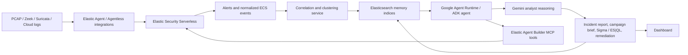

# Blackgate Target Architecture

This is the recommended MVP architecture for a hackathon build using Google Cloud agent tooling, Elastic Security Serverless, Elastic Agent/Agent Builder, Elasticsearch memory, and Gemini.

## Product Thesis

Blackgate is an AI SOC analyst that turns packet/log telemetry into campaign-level threat intelligence.

The winning demo should not be "chat over logs." It should show the agent doing the work a tired SOC analyst wants done:

1. Ingest Zeek and Suricata telemetry through Elastic.
2. Cluster related alerts into incidents.
3. Link repeated incidents into campaigns.
4. Map behavior to MITRE ATT&CK.
5. Use Gemini for reasoning, narrative, uncertainty handling, and next actions.
6. Persist memory in Elasticsearch so every new investigation improves future triage.

## Current Architecture Problem

The current code has the right components, but the ownership boundaries are muddy:

- MongoDB is used as the knowledge base, while the product requirement says memory should live in Elasticsearch and Elastic Security.
- The backend writes custom `security-alerts` and `security-incidents` documents, but it does not fully align them with Elastic Security data streams, ECS fields, alerts, cases, or Attack Discovery.
- The ADK agent is acting as both orchestrator and security reasoning layer. It should orchestrate, but Elastic should be the security system of record.
- Campaign clustering is currently deterministic and useful for a demo, but the fingerprint is too narrow: it uses MITRE IDs and IPs, while campaigns should also consider domains, time windows, entities, signatures, infrastructure overlap, and embedding similarity.
- MITRE mapping is mostly signature-string matching plus Gemini enrichment. For credibility, it should combine Elastic detection/rule metadata, ATT&CK knowledge stored in Elasticsearch, and Gemini as the final analyst layer.

## Target System



## Agent Count

Blackgate should use one reasoning agent for the MVP:

- `soc_orchestrator`: a single Gemini/ADK SOC analyst that calls Elastic MCP tools and the local correlation pipeline.

It should also use one Elastic data collection/control plane:

- Elastic Agent/Fleet or supported agentless integrations to collect telemetry into Elastic Security Serverless.

That means there are two different "agent" concepts:

1. The Google/Gemini reasoning agent that investigates and explains.
2. The Elastic Agent or agentless integration layer that collects security data.

The product does not need separate Gemini sub-agents for forensic hunting, reporting, and Sigma writing yet. Those are sequential steps over the same evidence set, not truly independent tasks. Add more reasoning agents only if we later need parallel specialist workflows, such as malware triage, cloud posture analysis, and endpoint response running at the same time.

## Current Elastic Agent Status

The folder `backend/elastic-agent-9.4.1-darwin-aarch64` is an unpacked Elastic Agent distribution for local macOS testing. The application does not execute that folder directly.

The runtime currently uses:

- Elastic/Elasticsearch Python client for indexing and querying.
- Elastic Agent Builder MCP endpoint when `KIBANA_URL` and `ES_API_KEY` are configured.
- Local Elasticsearch MCP fallback when those serverless settings are absent.

To truly use Elastic Agent in the demo, enroll Elastic Agent through Fleet into the Elastic Security Serverless project, or use Elastic's agentless integrations for supported cloud/SaaS sources. The backend should consume the resulting Elastic Security events and alerts; it should not vendor or manage the Elastic Agent binary as part of FastAPI business logic.

## Platform Responsibilities

### Google Cloud

Use Google Cloud for the agent runtime and deployment layer:

- Agent Development Kit or Agent Runtime for the orchestrator.
- Gemini model calls for investigation synthesis and structured classification.
- Cloud Run for the FastAPI API and demo dashboard backend.
- Cloud Storage plus Eventarc for packet/log upload triggers.
- Secret Manager for Elastic and Gemini credentials.
- Cloud Logging/Trace for agent observability.

Google's current Agent Platform docs support ADK agents, custom agents, sessions, Memory Bank, Agent Gateway, tracing, logging, and monitoring. For this product, use Google session state for conversation continuity, but use Elasticsearch for security memory.

### Elastic Security Serverless

Use Elastic as the security data plane and source of truth:

- Elastic Agent/Fleet policies for host, network, and log collection.
- Agentless integrations where available for cloud/SaaS sources.
- Elastic Security alerts, prebuilt rules, entity analytics, cases, timelines, and dashboards.
- Attack Discovery for native AI grouping of alert relationships, MITRE matrix mapping, involved users/hosts, and likely threat actor context.
- Elastic Agent Builder MCP endpoint as the tool interface exposed to the Google/Gemini agent.
- Elasticsearch indices for memory, incidents, campaigns, MITRE knowledge, embeddings, and investigation outputs.

Elastic docs explicitly position Attack Discovery for discovering relationships across multiple alerts and mapping them to MITRE ATT&CK. That should be a core MVP capability, not a side note.

## Elasticsearch Memory Model

Replace MongoDB as primary memory with Elasticsearch indices:

### `blackgate.alerts`

Normalized alert/event documents.

Important fields:

- `@timestamp`
- `event.kind`, `event.category`, `event.type`, `event.action`
- `source.ip`, `destination.ip`, `dns.question.name`, `url.domain`
- `rule.name`, `rule.id`, `rule.ruleset`, `rule.severity`
- `threat.technique.id`, `threat.technique.name`, `threat.tactic.name`
- `blackgate.ingest.source`: `zeek`, `suricata`, `elastic_defend`, `gcp`, etc.
- `blackgate.raw_ref`

### `blackgate.incidents`

One document per correlated incident.

Important fields:

- `incident.id`
- `incident.title`
- `incident.status`
- `risk_score`
- `severity`
- `time.start`, `time.end`
- `entities.ips`, `entities.hosts`, `entities.users`, `entities.domains`
- `mitre.techniques`
- `campaign.id`
- `evidence.alert_ids`
- `summary`
- `narrative`
- `recommended_actions`
- `embedding_text`
- `embedding`

### `blackgate.campaigns`

One document per campaign cluster.

Important fields:

- `campaign.id`
- `campaign.name`
- `campaign.confidence`
- `campaign.first_seen`, `campaign.last_seen`
- `campaign.techniques`
- `campaign.infrastructure`
- `campaign.related_incident_ids`
- `campaign.hypothesis`
- `campaign.evidence`
- `campaign.embedding`

### `blackgate.mitre_knowledge`

MITRE ATT&CK technique reference and local mapping notes.

Important fields:

- `technique.id`
- `technique.name`
- `tactic.name`
- `description`
- `detection_notes`
- `elastic_rule_refs`
- `example_queries`
- `embedding`

### `blackgate.agent_memory`

Long-term agent memories that improve future investigations.

Important fields:

- `memory.id`
- `memory.type`: `entity`, `campaign`, `analyst_feedback`, `false_positive`, `playbook`
- `memory.scope`
- `memory.text`
- `linked_entities`
- `linked_incidents`
- `confidence`
- `expires_at`
- `embedding`

## Agent Tooling Contract

Expose these Elastic Agent Builder MCP tools to the Google agent:

1. `search_alerts`
   - Hybrid keyword/vector search over Elastic alerts and normalized telemetry.

2. `run_esql`
   - Controlled ES|QL query execution for timelines, joins, aggregations, and entity pivots.

3. `run_attack_discovery`
   - Calls Elastic Attack Discovery or retrieves latest discoveries.

4. `get_entity_context`
   - Given IP/domain/user/host, returns related alerts, incidents, campaigns, risk, and recent memories.

5. `cluster_incidents`
   - Runs deterministic plus vector similarity clustering and writes/updates `blackgate.incidents`.

6. `upsert_campaign`
   - Creates or updates campaign memory from incident overlap.

7. `map_mitre`
   - Combines Elastic rule metadata, MITRE knowledge index, deterministic mappings, and Gemini classification.

8. `save_investigation`
   - Persists final report, evidence links, ES|QL queries, MITRE mapping, campaign hypothesis, and remediation.

## MVP Investigation Flow

1. User uploads PCAP or demo logs.
2. Cloud Run parses Zeek/Suricata output or receives Elastic-collected events.
3. Events are indexed into Elastic using ECS-compatible fields.
4. Elastic Security rules and/or custom correlation create alert candidates.
5. Agent calls `run_attack_discovery` and `search_alerts`.
6. Agent calls `cluster_incidents` to group alerts by source, destination, time window, signatures, ATT&CK technique, and embedding similarity.
7. Agent calls `get_entity_context` for top IPs/domains/hosts.
8. Agent calls `map_mitre` to produce technique IDs with confidence and evidence.
9. Agent calls `upsert_campaign` to connect the incident to a campaign.
10. Gemini writes a structured analyst report with:
    - Incident summary
    - Timeline
    - Campaign hypothesis
    - MITRE ATT&CK mapping
    - Evidence
    - Confidence and gaps
    - Sigma or ES|QL detection
    - Remediation steps
11. Report is written back to Elasticsearch and shown in the dashboard.

## Campaign Clustering Logic

Use a hybrid scoring model:

- Entity overlap: shared IPs, domains, hosts, users.
- Behavior overlap: shared MITRE techniques and tactics.
- Temporal proximity: events within the same active window.
- Detection overlap: same Suricata signatures, Elastic rules, anomaly jobs, or alert names.
- Infrastructure patterns: ASN, country, certificate, JA3/JA4 if available.
- Semantic similarity: embeddings of incident narratives and alert summaries.

Example score:

```text
campaign_score =
  0.25 * entity_overlap +
  0.25 * mitre_overlap +
  0.15 * temporal_proximity +
  0.15 * detection_overlap +
  0.20 * semantic_similarity
```

For the hackathon MVP, implement this with a simple deterministic scorer plus Elasticsearch vector search. Show the score and the reason the cluster exists.

## MITRE Mapping Logic

Use a layered approach. Local dictionaries must never be the primary source of MITRE truth; they are only a low-confidence fallback for demo telemetry that has not yet passed through Elastic Security rule enrichment.

1. Elastic rule metadata if the alert already contains `threat.technique.*`.
2. Related Elastic Security alerts and detection rules discovered through Elasticsearch queries.
3. Search `blackgate.mitre_knowledge` for candidate techniques, detection notes, and ES|QL examples.
4. Gemini selects or adds technique IDs only when Elastic evidence is incomplete, and must explain evidence.
5. Local deterministic mappings for Suricata/Zeek signatures as the final low-confidence fallback.
6. Store confidence and evidence, not only the final label.

Required output shape:

```json
{
  "technique_id": "T1071.004",
  "technique_name": "Application Layer Protocol: DNS",
  "tactic": "Command and Control",
  "confidence": 0.82,
  "evidence": [
    "Repeated DNS queries from source host",
    "Domain also appears in Suricata alert context"
  ],
  "source": "elastic_rule|deterministic|gemini|hybrid"
}
```

## What To Change In This Repo

Priority 1:

- Replace MongoDB knowledge-base usage with Elasticsearch-backed memory indices.
- Rename custom indices to a coherent Blackgate namespace, or use Elastic data streams where appropriate.
- Add an index bootstrap script for alerts, incidents, campaigns, MITRE knowledge, and agent memory.
- Update `backend/services/campaigns.py` to use multi-factor campaign scoring.
- Update `backend/services/mitre_mapper.py` to emit confidence, tactic, evidence, and source.

Priority 2:

- Add Elastic Agent Builder MCP tools matching the contract above.
- Update `backend/agent.py` so Gemini orchestrates tools but does not own the source of truth.
- Add an endpoint like `/investigations/run` that performs the full pipeline and returns structured JSON for the frontend.

Priority 3:

- Update the dashboard to show:
  - Incident clusters
  - Campaign graph
  - MITRE matrix coverage
  - Evidence timeline
  - Agent reasoning and confidence

## Demo Story

The strongest hackathon story:

"We uploaded raw network evidence. Elastic collected, normalized, and detected suspicious behavior. Blackgate used Elastic Security and Gemini to collapse noisy alerts into one campaign, mapped it to MITRE ATT&CK, showed the evidence timeline, generated an ES|QL/Sigma detection, and remembered the campaign for the next investigation."

That story is clear, credible, and visibly uses both Google Cloud and Elastic.
